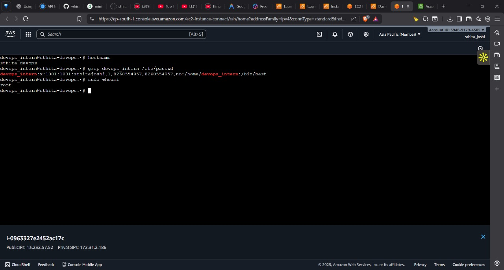
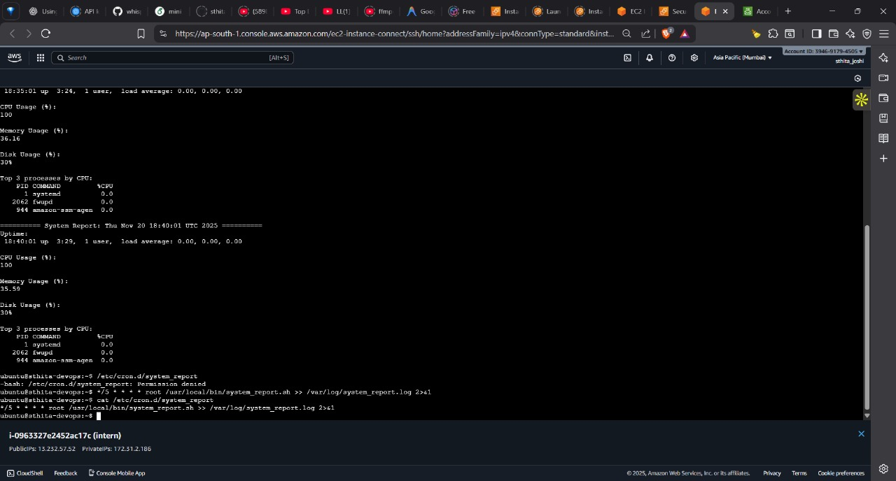
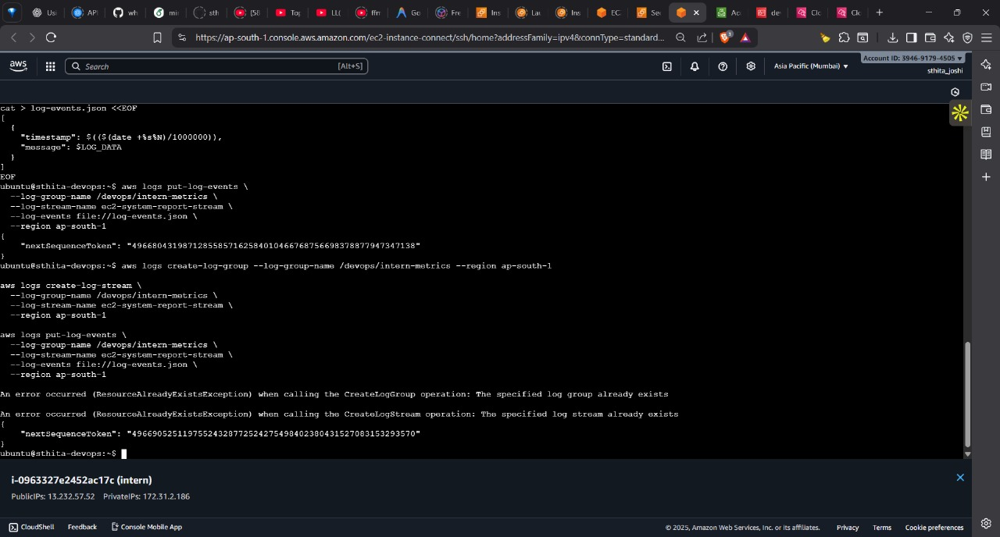
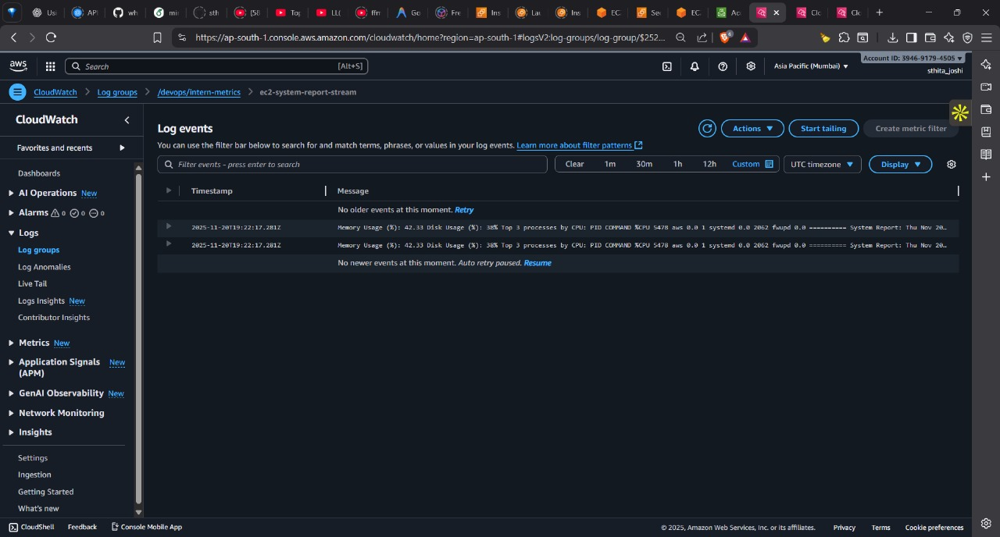
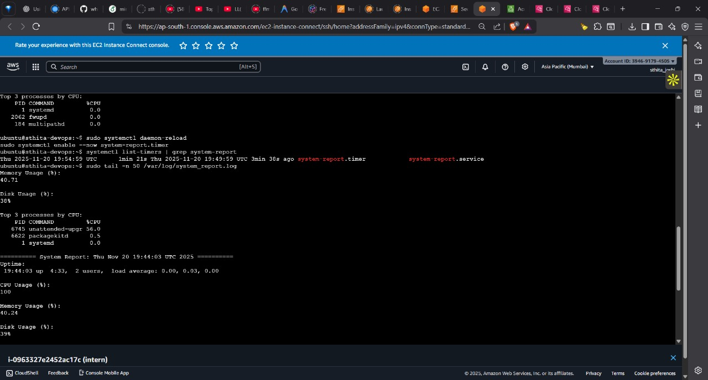
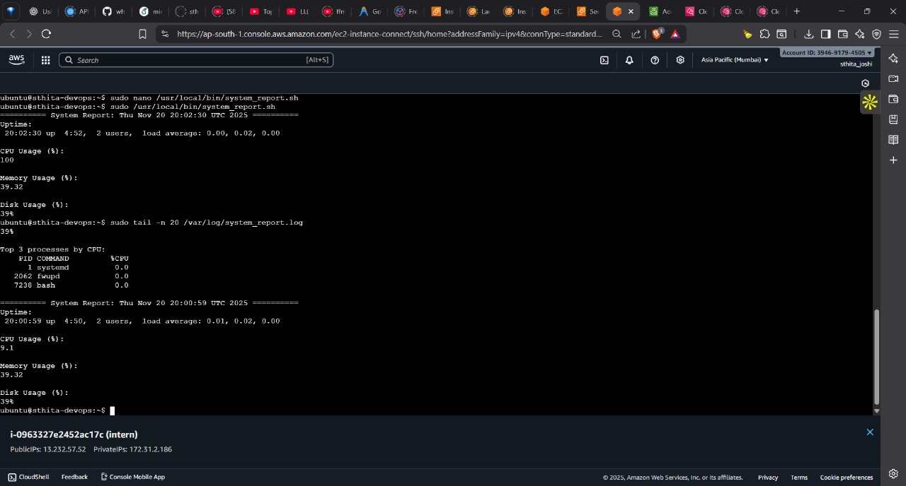

***

# DevOps Intern Assignment

## Overview

This repository contains the implementation of the DevOps Intern Assignment, demonstrating skills in:

- **Linux administration**
- **AWS EC2 setup**
- **Service configuration**
- **Automation (bash + cron)**
- **AWS CloudWatch integration**

All tasks were performed on an Ubuntu 22.04 LTS **t2.micro Free-Tier EC2** instance.

***

## 📌 Part 1 — Environment Setup

**Steps Performed:**

- Launched an Ubuntu 22.04 LTS t2.micro EC2 instance.
- Connected to the instance via SSH:
  ```bash
  ssh -i powerplay.pem ubuntu@ip-172-31-1-124
  ```
- Created a new user:
  ```bash
  sudo adduser devops_intern
  ```
- Granted password-less sudo access:
  ```bash
  sudo visudo
  # Add line: devops_intern ALL=(ALL) NOPASSWD:ALL
  ```
- Changed hostname:
  ```bash
  sudo hostnamectl set-hostname sthita-devops
  ```

**Deliverables:**
**Screenshot:**



***

## 📌 Part 2 — Simple Web Service Setup

**Steps Performed:**

- Installed Nginx:
  ```bash
  sudo apt update
  sudo apt install -y nginx
  ```
- Fetched instance metadata:
  ```bash
  INSTANCE_ID=$(curl -s http://169.254.169.254/latest/meta-data/instance-id)
  ```
- Retrieved server uptime:
  ```bash
  UPTIME=$(uptime -p)
  ```
- Created dynamic web page:
  ```bash
  sudo tee /var/www/html/index.html > /dev/null <<EOF
  <html>
  <body>
    <h1>DevOps Intern Assignment</h1>
    <p>Your Name: <b>YOUR_NAME_HERE</b></p>
    <p>Instance ID: $INSTANCE_ID</p>
    <p>Server Uptime: $UPTIME</p>
  </body>
  </html>
  EOF
  ```

**Deliverable:**
**Screenshot:**  


***

## 📌 Part 3 — Monitoring Script

**Script:** `scripts/system_report.sh`
```bash
#!/bin/bash
echo "===== System Report: $(date) ====="
echo "Uptime: $(uptime -p)"
echo "CPU Usage: $(top -bn1 | grep 'Cpu(s)' | awk '{print $2 + $4}')%"
echo "Memory Usage: $(free | awk '/Mem/ {printf(\"%.2f%%\", $3/$2 * 100.0)}')"
echo "Disk Usage: $(df -h / | awk 'NR==2 {print $5}')"
echo "Top 3 CPU Processes:"
ps -eo pid,ppid,cmd,%cpu --sort=-%cpu | head -4
echo -e "\n"
```

**Cron Job Setup:**
```bash
sudo crontab -e
# Add the following line:
*/5 * * * * /usr/local/bin/system_report.sh >> /var/log/system_report.log
```

**Deliverables:**

**Screenshots:**  



***

## 📌 Part 4 — AWS Integration

**Steps:**

- Created CloudWatch log group:
  ```bash
  aws logs create-log-group --log-group-name /devops/intern-metrics
  ```
- Created log stream:
  ```bash
  aws logs create-log-stream \
    --log-group-name /devops/intern-metrics \
    --log-stream-name system-report-stream
  ```
- Uploaded logs:
  ```bash
  TOKEN=$(aws logs put-log-events \
    --log-group-name /devops/intern-metrics \
    --log-stream-name system-report-stream \
    --log-events "$(jq -n --arg m "$(cat /var/log/system_report.log)" --arg t "$(date +%s000)" '[{ "timestamp": ($t|tonumber), "message": $m }]')" \
    --query 'nextSequenceToken' --output text)
  ```

**Deliverables:**

**Screenshots:**  




***

## 📌 Part 5 — Documentation & Cleanup

**Steps:**

- Wrote this `README.md` explaining setup, scripts, commands, and steps.
- Terminated the EC2 instance (to avoid charges).

***

## 📁 Repository Structure

```
.
├── README.md
├── scripts/
│   └── system_report.sh
├── cron/
│   └── cron_config.txt
└── screenshots/
    ├── part1_hostname_user_sudo.png
    ├── part2_webpage.png
    ├── part3_cron_and_logs.png
    ├── part4_cloudwatch.png
    |-- Bonus
    |-- Bonus if more then 80% goes 
```

### Bonus – systemd timer instead of cron

The periodic execution of `system_report.sh` was moved from cron to systemd:

- `/etc/systemd/system/system-report.service` runs the script and appends output to `/var/log/system_report.log`.
- `/etc/systemd/system/system-report.timer` triggers the service every 5 minutes (`OnUnitActiveSec=5min`).

This improves manageability and introspection via `systemctl` and `journalctl`.

### Bonus – Disk usage email alert

The script `/usr/local/bin/system_report.sh` was extended to calculate numeric disk usage from `df -h /` and trigger an alert when usage > 80%. The alert is logged to `/var/log/system_report.log`, and the script is prepared to send notifications via AWS SES or the local `mail` command (once configured).

**Screenshots:**  




***


***
## 🧪 How to Reproduce the Environment

1. **Launch** a Free-Tier Ubuntu EC2 instance.
2. **Create** user `devops_intern` and configure sudo access.
3. **Install** Nginx and create HTML page as shown.
4. **Copy** `system_report.sh` to `/usr/local/bin/` and make executable:
   ```bash
   sudo chmod +x /usr/local/bin/system_report.sh
   ```
5. **Add** cron entry.
6. **Install** AWS CLI:
   ```bash
   sudo apt install awscli -y
   ```
7. **Configure** AWS CLI:
   ```bash
   aws configure
   ```
8. **Create** CloudWatch log group and stream, **upload logs**.
***